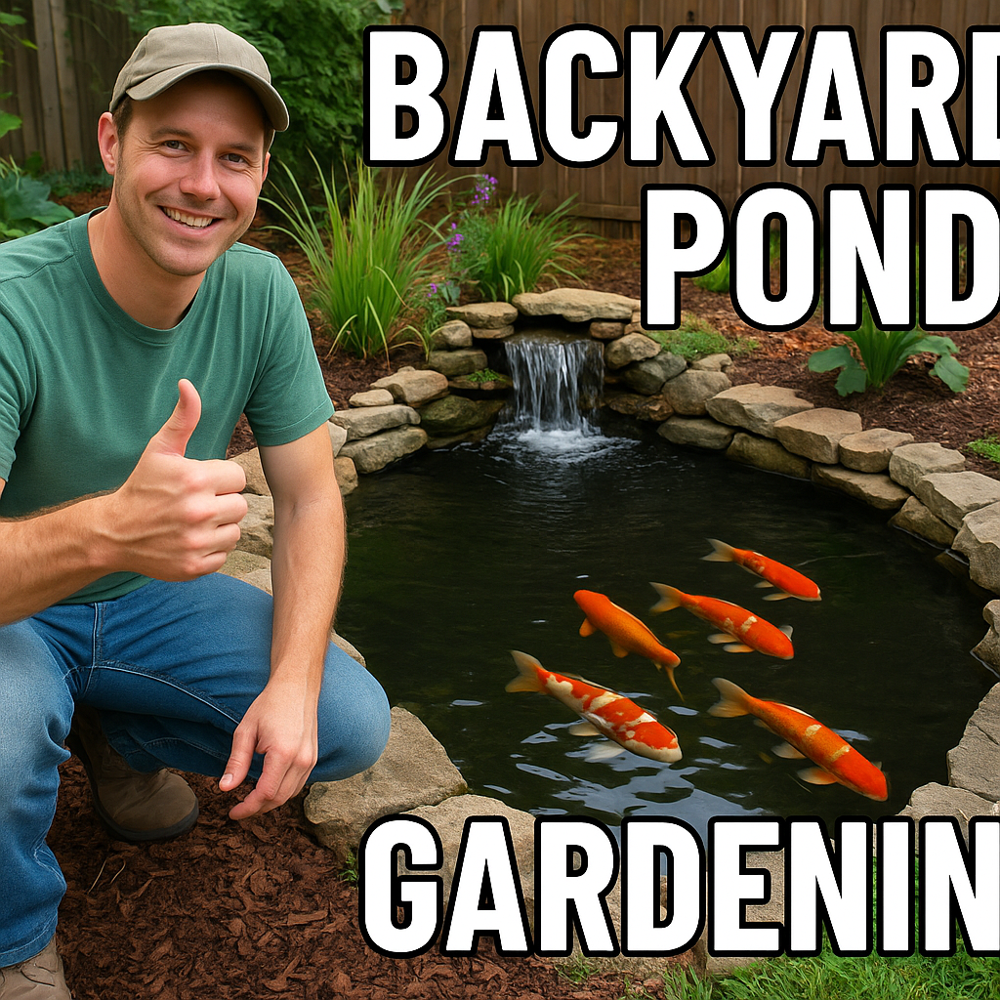

# AI comments

The AI generates a polite Youtube comment responding to the users input.

## Example 1:

User input: "I really enjoyed this video!"

AI comment response: "Thank you so much for watching and for your kind words! I'm glad you enjoyed the video. If you have any suggestions for future content, feel free to let me know. *smile emoji*"

## Example 2: 

User input: "This video sucked!"

AI comment response: "Hey there, I'm sorry to hear that you didn't enjoy the video. Everyone has different tastes, so it's totally okay if it didn't resonate with you. I appreaciate you expressing your opinion though! Hope you find some content taht you like better. Have a great day! *smile emoji*"

# AI thumbnail images

The AI generates a Youtube thumbnail based on the users input.

## Example 1:

User input: "A thumbnail for a gardening video where the person has built a backyard pond for koi fish."

AI thumbnail image: 

## Example 2:

User input: "A thumbnail for youtube video about halloween shopping and shoppping haul."

AI thumbnail image: 